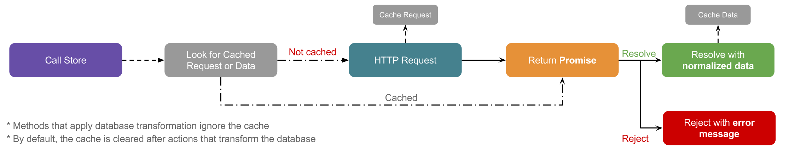

# Premiere

[](https://www.npmjs.org/package/premiere)
[](https://codeclimate.com/github/pedsmoreira/premiere)

Easy and powerful _standalone_ Javascript ORM for consuming Restful APIs.

## Features
- Works very nicely with [TypeScript](http://typescriptlang.org/) and ES6
- Easy configuration
- Model normalization and denormalization
- Caching
- Foreign keys
- Header support _(frequently used with Authorization and CSRF token)_

## Workflow


** For more about how promises work, check out [Dave Atchley's article](http://www.datchley.name/es6-promises/)

## Installing

Using [npm](http://npmjs.com/):

```bash
$ npm install premiere --save
```

Using [yarn](https://yarnpkg.com/):

```bash
$ yarn add premiere
```

Using [bower](https://bower.io/):

```bash
$ bower install premiere --save
```

Using cdn:

```html
<script src="https://unpkg.com/premiere/dist/premiere.min.js"></script>
```

## Quick Samples

Creating a new Model
 
```js
// TODO
```

Creating a custom Store

```js
// TODO
```

Creating an API

```js
// TODO
```

Working with the cache

```js
// TODO
```

Persisting the **index** result

With MobX

```js
// TODO
```

## Examples
- [Premiere Player](https://github.com/pedsmoreira/premiere-player), https://premiere-player.herokuapp.com/ 

## Typescript
Premiere is written in Typescript and it includes [TypeScript](http://typescriptlang.org/) definitions

```typescript
import * as Premiere from 'premiere';
```

## Inspiration
Premiere is inspired by [Laravel](https://laravel.com/)

Their sintax and easiness of use are an inspiration for building simple and powerful libraries.

## Dependencies
Premiere uses [axios](https://github.com/mzabriskie/axios) for handling HTTP Requests, it's a very simple and powerful library.

## License
MIT
